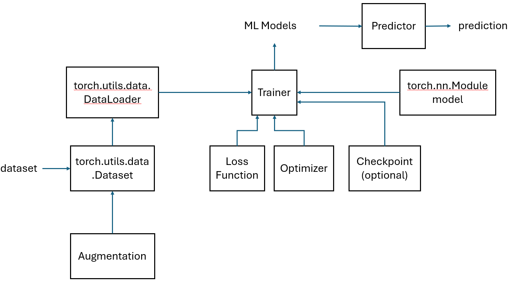
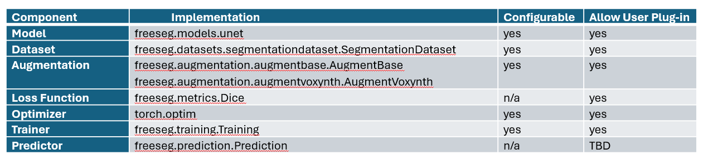
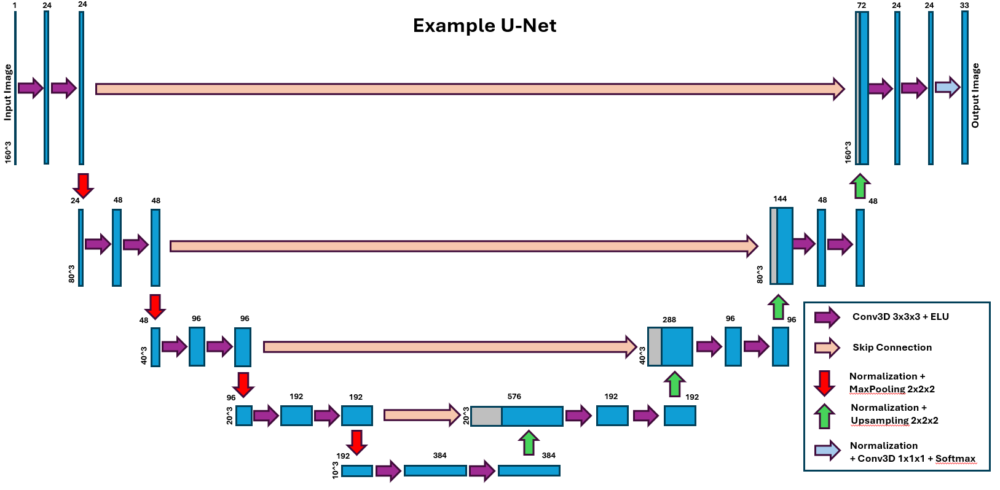

# Architecture Documentation

This document describes the architecture and design of FreeSeg.

## Table of Contents

- [System Overview](#system-overview)
- [U-Net Architecture](#u-net-architecture)
- [Augmentation Pipeline](#augmentation-pipeline)
- [Training Pipeline](#training-pipeline)
- [Inference Pipeline](#inference-pipeline)
- [Extension And Integration](#extension-and-integration)
- [Future Enhancements](#future-enhancements)
- [References](#references)

---

## System Overview

FreeSeg is a PyTorch-based deep learning framework, specifically designed for FreeSurfer-adjacent models. The system is modular and extensible, supporting various architectures, augmentations, and training strategies.

### Key Components

- **Models**: Neural network architectures (U-Net)
- **Datasets**: Data loading and preprocessing
- **Augmentation**: Data augmentation pipeline
- **Training**: Training loop and optimization
- **Prediction**: Inference and segmentation
- **Evaluation**: Metrics and evaluation tools
- **Configuration**: Configuration management

\
\


### Module Structure

#### Core Modules

```
freeseg/
  |-- __init__.py          # Package initialization
  |-- config.py            # Configuration management
  |-- training.py          # Training class
  |-- prediction.py        # Prediction class
  |-- evaluation.py        # Evaluation class
  |-- checkpoint.py        # Checkpoint management
  |-- metrics.py           # Loss functions and metrics
  |-- filter.py            # Filtering utilities
```

#### Model Modules

```
freeseg/models/
  |-- __init__.py
  |-- unet.py              # U-Net architecture
```

#### Dataset Modules

```
freeseg/datasets/
  |-- __init__.py
  |-- segmentationdataset.py  # Segmentation dataset
```

#### Augmentation Modules

```
freeseg/augmentation/
  |-- __init__.py
  |-- augmentbase.py      # Base augmentation class
  |-- augmentvoxynth.py   # Voxynth augmentation class
```

#### Utility Modules

```
freeseg/utils/
  |-- __init__.py
  |-- utility.py          # Utility functions
```

#### Voxynth Modules
**Notes**: Modified from Voxynth implementation https://github.com/dalcalab/voxynth/

```
freeseg/voxynth/
  |-- __init__.py
  |-- augment.py          # Voxynth augmentations
  |-- filter.py           # Filtering
  |-- noise.py            # Noise generation
  |-- synth.py            # Synthesis
  |-- transform.py        # Transformations
  |-- utility.py          # Utilities
```

### Design Principles

#### Modularity

- Each component is independent and reusable
- Easy to extend and modify

#### Flexibility

- Configurable via YAML and CLI
- Extensible components (network architectures, augmentation pipeline, ...)

#### Reproducibility

- Deterministic training option
- Checkpoint saving/loading
- Configuration saving

#### Usability

- Simple command-line interface
- Comprehensive logging
- TensorBoard integration (to be tested)
\
\


---

## U-Net Architecture

### Overview

FreeSeg implements a 3D/2D U-Net architecture with the following features:

- **Encoder-Decoder Structure**: Symmetric encoder and decoder paths
- **Skip Connections**: Feature concatenation (not addition) between encoder and decoder
- **Multi-Scale Features**: Hierarchical feature extraction
- **Flexible Depth**: Configurable number of levels
- **Residual Connections**: Optional residual blocks
- **Normalization**: Batch or instance normalization

### Network Parameters

| Parameter | Description | Default |
|-----------|-------------|---------|
| `ndims` | Number of dimensions (2 or 3) | 3 |
| `nb_levels` | Number of encoder/decoder levels | 3 |
| `nb_features` | Base number of features | 24 |
| `feat_mult` | Feature multiplier per level | 2 |
| `nb_conv_per_level` | Convolutions per level | 2 |
| `conv_size` | Convolution kernel size | 3 |
| `pool_size` | Pooling/downsampling size | 2 |
| `use_residuals` | Use residual connections (False or True) | False |
| `norm` | Normalization type ("batch" or "instance") | "batch" |
| `track_running_stats` | Keep running mean and variance (False or True) | False |
| `activation` | Activation function ("elu" or "relu") | "elu" |
| `final_pred_activation` | Final activation function ("softmax", "sigmod", or "linear") | "softmax" |
| `upsample_interpolation` | Upsample interpolation method ("linear" or "nearest") | "linear" |
| `weight_init` | Weight initialization ("xavier_uniform" or "zeros") | "xavier_uniform" |
| `skip_connect` | Where to take the skip connection from ("norm" or "encoder") | "norm" |

### Network Diagram

Example U-Net with `ndim=3`, `nb_levels=5`, `nb_features=24`, `nb_conv_per_level=2`, `feat_mult=2`, `conv_size=3`, `pool_size=2`, `norm=batch`, `activation=elu`, `final_pred_activation=softmax`:
\
\


### Output Layer

- **Final Convolution**: `nb_features → nb_labels`
- **Activation**: Softmax (multi-class) or Sigmoid (binary)
- **Output Shape**: `[N, nb_labels, H, W, D]`

---

## Augmentation Pipeline

Augmentations are applied in the order they are specified in the configuration file.

- **`freeseg.augmentation.augmentbase`**
  - **`AugmentBase`**: base augmentation wrapper class
  - **Individual augmentation classes**
    - **`SpatialDeformation`**: Affine + non-linear spatial transformations
    - **Cropping classes**: choose from one of the follow
      - **`CenterCrop`**
      - **`RandomCrop`**
      - **`CentroidCrop`**
    - **`Flip`**: Left-right flipping (with label swapping)
    - **`BiasFieldCorruption`**: MRI bias field corruption
    - **`IntensityAugmentation`**: Noise, gamma correction, normalization
    - **`MimicResolution`**: Resolution mimicking
    - **`RemapLabels`**: Label remapping
    - **`SampleConditionalGMM`**: Conditional intensity image generation using Gaussian Mixture Models
- **`freeseg.augmentation.augmentvoxynth`**
  - **`AugmentVoxynth`**: derived augementation wrapper class `AugmentVoxynth` → `AugmentBase`
  - **Individaul augmentation classes** (implemented using Voxynth library https://github.com/dalcalab/voxynth/)
    - **`BiasFieldCorruption`**: MRI bias field corruption
    - **`IntensityAugmentation`**: Noise, gamma correction, normalization

---

## Training Pipeline

### Two-Stage Training

#### Stage 1: Weighted L2 Pre-training

- **Purpose**: Pre-train model with weighted L2 norm loss function to provide initialization for Dice loss training
- **Loss**: Weighted L2 Loss
- **Duration**: `wl2_epochs` epochs

#### Stage 2: Dice Loss Training

- **Purpose**: Fine-tune model using soft Dice loss
- **Loss**: Soft Dice Loss
- **Duration**: `dice_epochs` epochs

### Training Components

**Training Class** (`freeseg.training.Training`)

- **Model Management**: Model initialization, checkpointing
- **Optimization**: Optimizer setup
- **Loss Computation**: Dice loss, weighted L2 loss
- **Metrics**: Dice scores, loss tracking
- **Evaluation**: Validation during training
- **Logging**: log files, TensorBoard (??? to be tested)

### Checkpoint System

**Checkpoint Class** (`freeseg.checkpoint.Checkpoint`)

Checkpoints contain:
- Model state dictionary
- Optimizer state dictionary
- Training epoch
- Best metrics (loss, dice)
- Model architecture
- Dataset configuration
- Label lookup table

---

## Inference Pipeline

### Prediction Flow

```
Input Image
  |
  v
Inference Model Building
  |-- Load checkpoint
  |-- Initialize model
  |-- Load weights
  |-- Assemble inference model
  |
  v
Preprocessing
  |-- Load image
  |-- Resample image to target resolution (if needed)
  |-- Crop image (if needed)
  |-- Normalize image
  |-- Pad image (if needed)
  |
  v
Inference
  |-- Inference model forward pass
  |
  v
Postprocessing
  |-- Remove posteriors padding (if needed)
  |-- Set posteriors outside the biggest connected component to zero (optional)
  |-- Set posteriors outside the largest connected component of each topological class to zero (optional)
  |-- Get hard segmentation
  |-- Combine segmentation and parcellation (optional)
  |
  v
Output Segmentation
```

### Prediction Class

**Prediction Class** (`freeseg.prediction.Prediction`)

- **`__init__`**: Class constructor
- **`build_model`**: Load and assemble models
  ```
  inference model =   segmentation model
                    + smooth posteriors (optional, '--smooth_posteriors')
                    + left-right flipped image prediction (optional, '--flip')
                    + parcellation model (optional)
  ```
- **`predict`**: Predict with the assembled inference model
  ```
  |-- Preprocess
  |   |-- Load image
  |   |-- Resample image to target resolution (if needed)
  |   |-- Crop image (if needed)
  |   |-- Normalize image
  |   |-- Pad image (if needed)
  |-- Run images through the inference model
  |-- Postprocess
  |   |-- Remove posteriors padding (if needed)
  |   |-- Set posteriors outside the biggest connected component to zero (optional, '--keep_biggest_component')
  |   |-- Set posteriors outside the largest connected component of each topological class to zero (optional, '--use_topology_classes')
  |   |-- Get hard segmentation
  |   |-- Combine segmentation and parcellation (optional, '--parc parc.pth')
  |-- Output segmentations and posteriors
  ```

  **Notes:**
  - The parcellation model is converted from the SynthSeg+ Tensorflow model.
  - **Robust machine learning segmentation for large-scale analysis of heterogeneous clinical brain MRI datasets** \
    B. Billot, M. Colin, Y. Cheng, S.E. Arnold, S. Das, J.E. Iglesias \
    PNAS (2023) \
    [ [article](https://www.pnas.org/doi/full/10.1073/pnas.2216399120) | [arxiv](https://arxiv.org/abs/2203.01969) ]

---

## Extension And Integration

### Adding New Models

- Create model class: can be either a complete implementation or a wrapper class providing the interface between Freeseg and the network implementation.
- Implement required methods
  - **`__init__(self, model_arch_dict)`**: takes dict `model_arch_dict` as input. Required `model_arch_dict` keywords: `nb_levels` and `ndims`.
    ```
       def __init__(self, model_arch_dict):
           self._model_arch_dict = {}
        
           # set network defaults
           self._setdefault_arch_dict()
           # update network parameters with user input
           self._update_arch_dict(model_arch_dict)

           ...

    ```
    **Notes**:
    - `model_arch_dict` is taken from model configurables.
    - `ndims` and `nb_levels` are required.
    - `num_channels` and `nb_labels` are not required. They are set in Training.setup() for `freeseg.models.unet.UNet` to dataset configurables `expected_num_channels` and `len(segmentation_labels)` respectively if they are missing from model configurables.
    - It is the individual network implementation's responsibility to check their availabilities.
     
  - **`_setdefault_arch_dict(self)`**: set network defaults in `self._model_arch_dict`to ensure the default values are recorded in checkpoints.
    ```
        def _setdefault_arch_dict(self):
            self._model_arch_dict["num_channels"] = 1   # number of network input channels
            self._model_arch_dict["nb_labels"] = 33     # number of network output features
            self._model_arch_dict["nb_levels"] = 5      # number of enc/dec levels
            self._model_arch_dict["ndims"] = 3          # number of spatial dims.

            ...
	    
    ```
  - **`_update_arch_dict(self, model_arch_dict)`**: update network parameters `self._model_arch_dict` with user input
    ```
       def _update_arch_dict(self, model_arch_dict):
           # update self._model_arch_dict
           for k in (model_arch_dict.keys()):
               self._model_arch_dict[k] = model_arch_dict[k]
    ```
  - **`forward(self, x, **kwargs)`**: torch.nn.Module forward method \
    **Notes**: The function needs to return a list to train with freeseg.training.Training class.
- Implement required property
  - **`arch_dict`**: getter method for instance variable `self._model_arch_dict`
    ```
       @property
       def arch_dict(self):
           return self._model_arch_dict   
    ```

### Adding New Augmentations

- Create augmentation wrapper class
  - (Optional) Inherit from `freeseg.augmentation.augmentbase.AugmentBase`
  - Implement **`def __init__(self, hp, transforms, crop_size=None, augmentation_dir=None, device=None, **kwargs)`**
    ```
    from freeseg.augmentation.augmentbase import AugmentBase

    # augmentation wrapper class derived from AugmentBase
    class AugmentWrapper(AugmentBase):
        # constructor
        def __init__(self, hp, transforms, crop_size=None, augmentation_dir=None, device=None, **kwargs):

            super().__init__(hp, transforms, device=devive, **kwargs)
	
            # initialize required instance variables
            # 1. valid_augmentations: augmentations supported in the class, used to validate augmentations requested
            #    extend base class augmentations, remove duplicates
            valid_augmentations = [ "augment1", "augment2", ... ]
            self.valid_augmentations.extend(valid_augmentations)
            # remove duplicates
            self.valid_augmentations = list(set(self.valid_augmentations))

            # 2. output_dir: output directory used in freeseg.augmentation.apply_augmentations() to save augmented volumes for debugging
            # this variable is inherit from base class, set self.output_dir if not inherited from base class
            # self.output_dir = augmentation_dir
	
            # 3. transforms: save the augmentations to be applied
            self.transforms = transforms

            # 4. individual augmentation instances: initiate augmentation instances that the wrapper class supports
            #    keep the instance names in lower cases. they need to match items in list `valid_augmentations`.
            self.augment1 = Augment1(hp=hp.get('Augment1'), device=device, **kwargs)
            self.augment2 = Augment2(hp=hp.get('Augment2'), device=device, **kwargs)

            ...

    ```
  - **Notes**:
    - The wrapper class instance will be created in `freeseg.training.Training.setup()`.
    - It is optional to inherit from `freeseg.augmentation.augmentbase.AugmentBase`.    
    - The constructor arguments:
      - required position arguments: `hp` and `transforms`
      - required keyword arguments:  `crop_size`, `augmentation_dir`,  and `device`
      - optional keyword arguments:  can be added as needed. The key/value pairs will be from both `dataset` and `preprocessing` configurables with same names.    
    - Keep augmentation instances in lower cases. They need to match items in list `valid_augmentations`.
    - The dict `hp` passed to each augmentation class is from the corresponding augmentation hyperparameter section in the config.yaml.
    - The augmentations are applied through `freeseg.augmentation.apply_augmentations()` call from a `torch.utils.data.Dataset` instance in the order that they are specified in config.yaml.
- Implement individual augmentation class: The augmentation classes inherit `torch.nn.Module`.
  - **example**:
  ```
  class Augment1(torch.nn.Module):
      # constructor
      def __init__(self, hp=None, device=None, **kwargs):
          super().__init__()

          # set up the hyperparameters
          ...


      # implemenation
      def forward(self, input, **kwargs):
          # argument input is a dict {'image':image, 'label':label, 'geom':geom}

          # ... implementation ...
	  
          # return preprocessed volumes as dict
          output = {
              'image': augmented_image,
              'label': augmented_label,
              'geom':  new_geom,
                   }
          return output
  ```


### Adding New Metrics

- Create metric class
- Inherit from `torch.nn.Module`
- Implement `__init__` and `forward` methods
  ```
    class MyMetrics(torch.nn.Module):
        def __init__(self, **kwargs):
            super().__init__()

        def forward(self, y_pred, y_true, **kwargs):
            # ... implementation ...
  ```
  **Notes**:
  - The constructor keyword arguments can be added as needed. The key/value pairs are from the configurables with same keywords placed under `wl2_metrics`, `model_metrics`, or `model_metrics_accuracy`.
  - See [Configuration Guide](CONFIGURATION.md) and `configs/` for examples.


### Adding New Datasets

- Create dataset class
- Inherit from `torch.utils.data.Dataset`
  ```
      class MyDataset(torch.utils.data.Dataset):
          def __init__(self, augment_obj, device=None, **kwargs):

              ...

              # load first label, update self.dataset_profile target_res
              ...
  ```
- Implement required methods:
  - **`process_dataset_attr(dataset_profile, traindir)`**: static method to process and update dataset configurables
    ```
        @staticmethod
        def process_dataset_attr(dataset_profile, traindir):
            ...
	
            return updated_dataset_profile
    ```
  - **`__len__(self)`**: return the number of training dataset entries
  - **`__getitem__(self, index)`**: load and preprocess training dataset of given index
    - **example**
    ```
        def __getitem__(self, index):
            # load data
            ...

            # apply data augmentation
            ...

            return index, augmented_image_tensor, onehot_augmented_label_tensor
    ```
    - **Note**:
      - Augmentations are applied in this method calling `freeseg.augmentation.apply_augmentations()`.
      - `tuple` is returned containing `index`, `image_tensor`, and `onehot_label_tensor`.
- Implement required property
  - **profile**: getter method for self.dataset_profile
    ```
        @property
        # getter method for processed dataset profile
        def profile(self):
            return self.dataset_profile
    ```

### Adding New Trainer Classes
- Create network trainer class
- Implement required method
  - **`__init__(self, dnn=None, train_loader=None, model_arch_dict=None, train_dataset_dict=None, train_output_folder=None, **kwargs)`**
    ```
        class MyTrainer:
            def __init__(self,
                         dnn=None,                 # deep neural network
                         train_loader=None,        # torch.utils.data.DataLoader              
                         model_arch_dict=None,     # network architecture dictionary
                         train_dataset_dict=None,  # training dataset dictionary
                         train_output_folder=None, # training output directory
                         **kwargs)
                ...
    ```
   - **`train_model(self, , lr=0.0001, epochs=100, steps_per_epoch=1000, metric_type=None, optimizer_cls=Npne, loss_fn=None)`**
   - **Note**: 'training' configurables are unpacked and passed to initialize the trainer class.
---

## Future Enhancements


---

## References

- **U-Net: Convolutional Networks for Biomedical Image Segmentation (Ronneberger et al., 2015)**
- **PyTorch Documentation**: https://pytorch.org/docs/
- **TensorBoard**: https://www.tensorflow.org/tensorboard
- **FreeSurfer**: https://freesurfer.net/
- **SynthSeg: Segmentation of brain MRI scans of any contrast and resolution without retraining** \
B. Billot, D.N. Greve, O. Puonti, A. Thielscher, K. Van Leemput, B. Fischl, A.V. Dalca, J.E. Iglesias \
Medical Image Analysis (2023) \
[ [article](https://www.sciencedirect.com/science/article/pii/S1361841523000506) | [arxiv](https://arxiv.org/abs/2107.09559) ]
- **Robust machine learning segmentation for large-scale analysis of heterogeneous clinical brain MRI datasets** \
B. Billot, M. Colin, Y. Cheng, S.E. Arnold, S. Das, J.E. Iglesias \
PNAS (2023) \
[ [article](https://www.pnas.org/doi/full/10.1073/pnas.2216399120) | [arxiv](https://arxiv.org/abs/2203.01969) ]
- **Voxynth**: https://github.com/dalcalab/voxynth/
